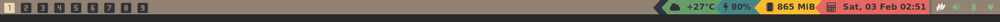

# NimdowStatus
A Simple Status For Nimdow Window Manager
https://github.com/avahe-kellenberger/nimdow

## Screenshot



## Installation
install font awesome for the icons. most distrobutions have this package in their repo.

### Clone Repo
```bash
git clone https://gitlab.com/ ~/.config/nimdow/nimdowstatus
```

### Compile
```bash
cd ~/.config/nimdow/nimdowstatus
nimble build -d:ssl
```
Or for some optimisation compiler flags use the below
```bash
cd ~/.config/nimdow/nimdowstatus
nimble release
```

### Config Nimdow

```bash
~/.config/nimdow/config.toml

```
Run the status bar on startup
```toml
[autostart]
exec = [
  "xsetroot -cursor_name left_ptr",
  "~/.config/nimdow/nimdowstatus/NimdowStatus"
]
```

Incluse font awesome for icons
```toml
barFonts = [
    "FontAwesome:size=14:antialias=true"
  ]
```

Open NimdowStatus.nim and make the edits you want, the either use rebuild.sh to kill the current runing status and re-compile Nimdowstatus

### ToDo

- The NimdowStatus needs to be turned into a daemon
- getWeather function needs to tunred into daemon
- More themes e.g dracula, catpuccin ect.. and shapes
